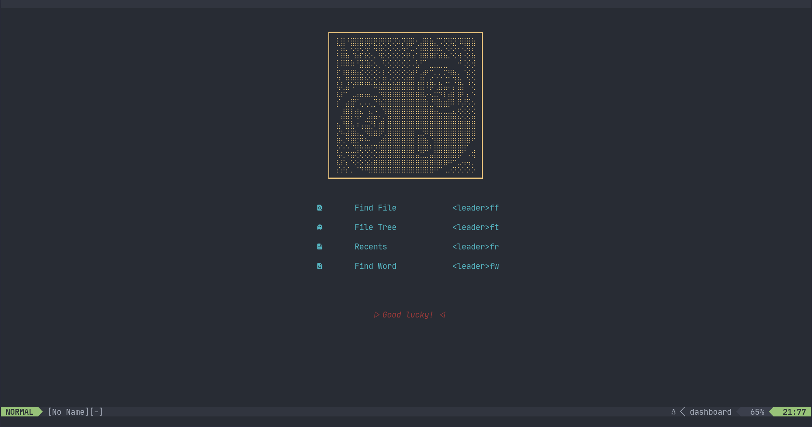
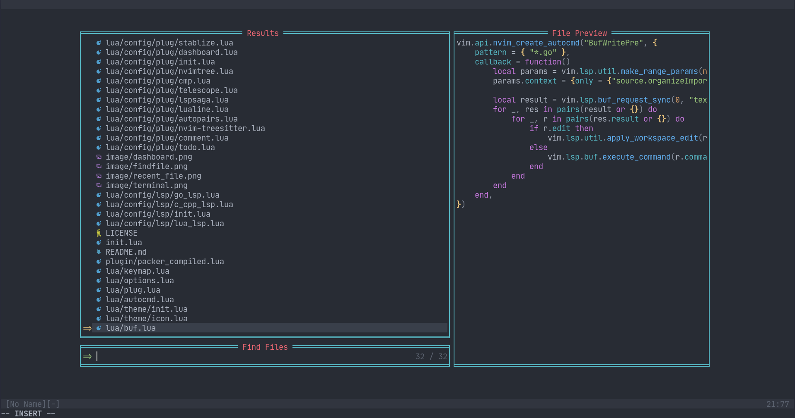
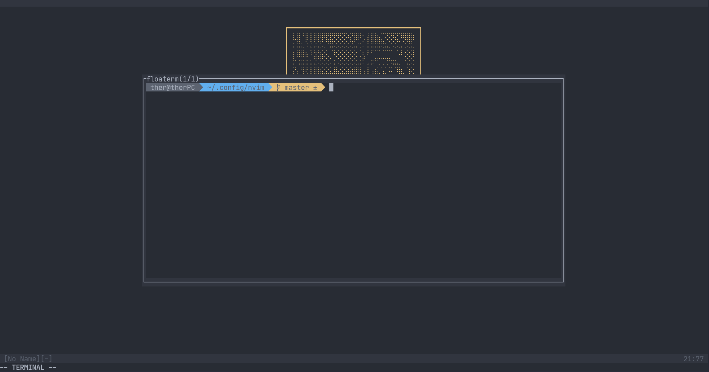
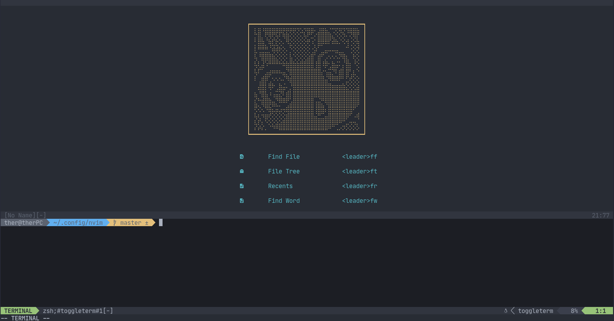

# nvim-config-lua

## 图片

## 快捷键

### Normal

|Action|Key|
|---|---|
|Exit Insert|jj|
|Exit Vim   |qq|
|Save       |ww|

### Windows

|Action|Key|
|---|---|
|Split Right|< leader > s h|
|Split Left |< leader > s l|
|Split Up   |< leader > s k|
|Split Blow |< leader > s j|
|Move To Right|< leader > w l|
|Move To Left|< leader > w h|
|Move To Up|< leader > w k|
|Move To Blow|< leader > w j|

### Buffer

|Action|Key|
|---|---|
|Close Current Buffer|< leader > b q|
|Pin Or Cancle Current Buffer|< leader > b p|
|Move To Previous Buffer|< leader > -|
|Move To Next Buffer|< leader> =|
|Choose Buffer 1|< leader > 1|
|Choose Buffer 2|< leader > 2|
|Choose Buffer 3|< leader > 3|
|Choose Buffer 4|< leader > 4|
|Choose Buffer 5|< leader > 5|
|Choose Buffer 6|< leader > 6|
|Choose Buffer 7|< leader > 7|
|Choose Buffer 8|< leader > 8|
|Choose Buffer 9|< leader > 9|
|Choose Buffer 10|< leader > 0|

### Terminal

|Action|Key|
|---|---|
|Open A Terminal|< leader > t n|

### Comment

|Action|Key|
|---|---|
|Comment & Cancle|< leader > /|

### TodoList

|Action|Key|
|---|---|
|Open|< leader > t d|

### Trouble

|Action|Key|
|---|---|
|Open & Close|< leader > t t|

### Other

|Action|Key|
|---|---|
|Find File|< leader > f f|
|Find this string in workspace|< leader > f g|
|Find string in workspace|< leader > f s|
|Open file browser|< leader > f t|
|Definitions|< leader > d f|
|References|< leader > r e|
|Git diff this file|< leader > d d|
|Git status|< leader > g s|
|Git branch|< leader > g b|
|Git commits|< leader > g c|
|Git commits on this branch|< leader > g t|
|Rename|< leader > r n|
|Hover doc|< leader > h h|
|Generate doc|< leader > d c|
